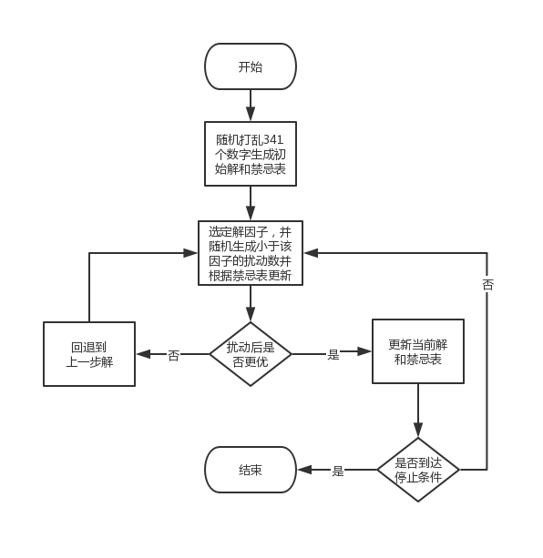
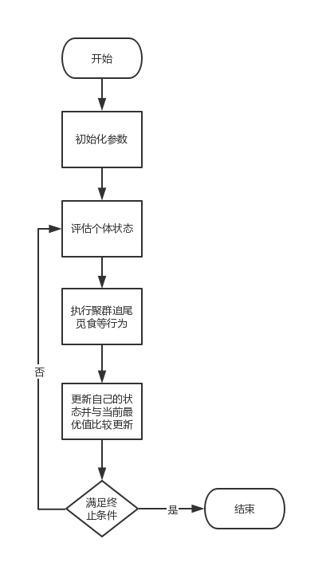
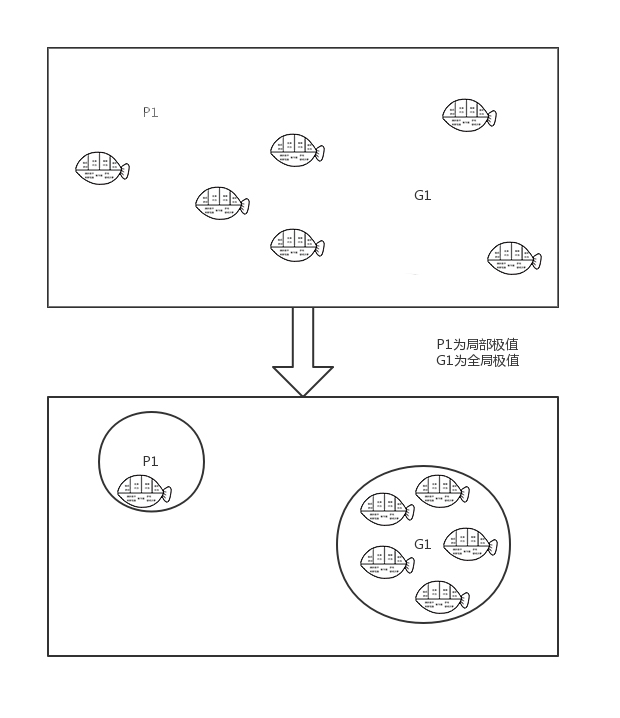
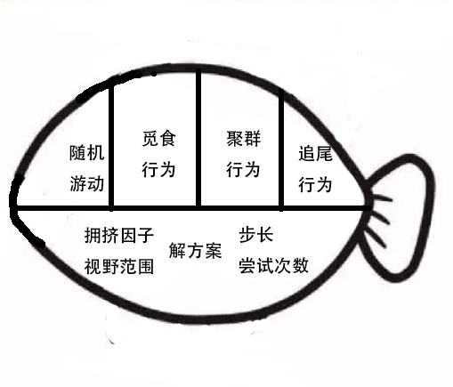
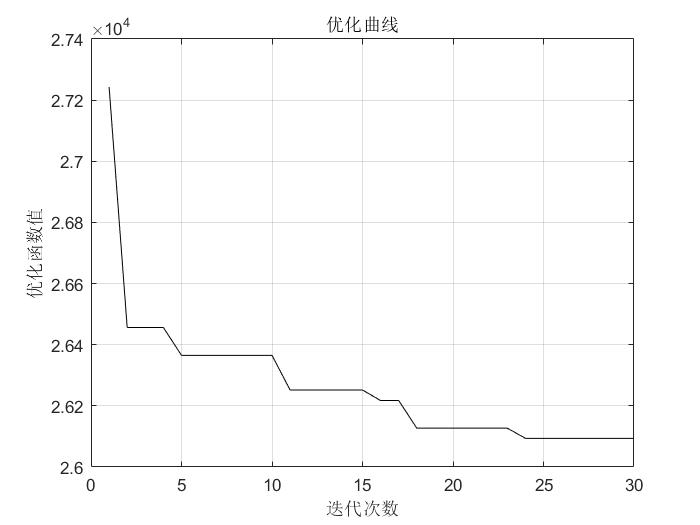
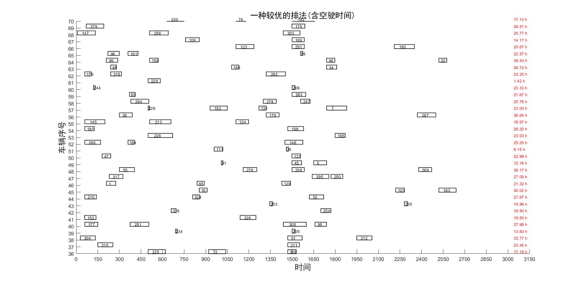
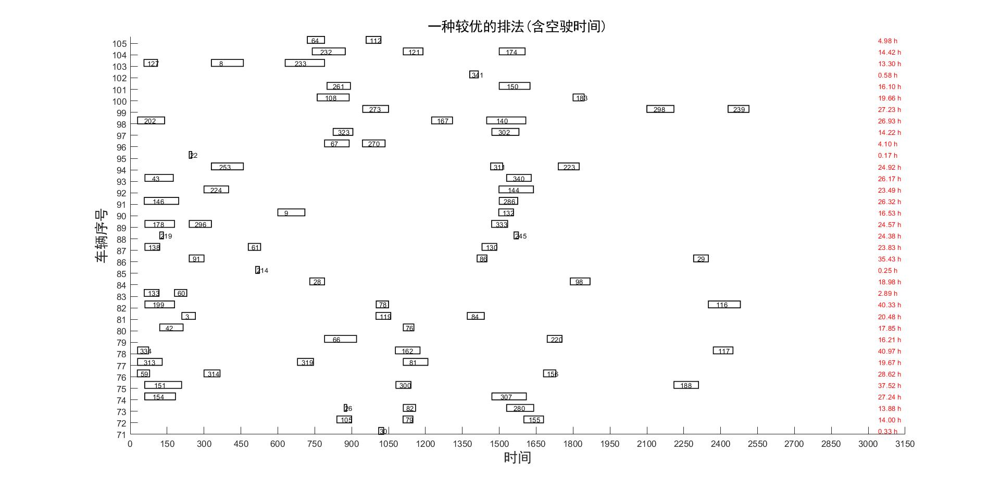
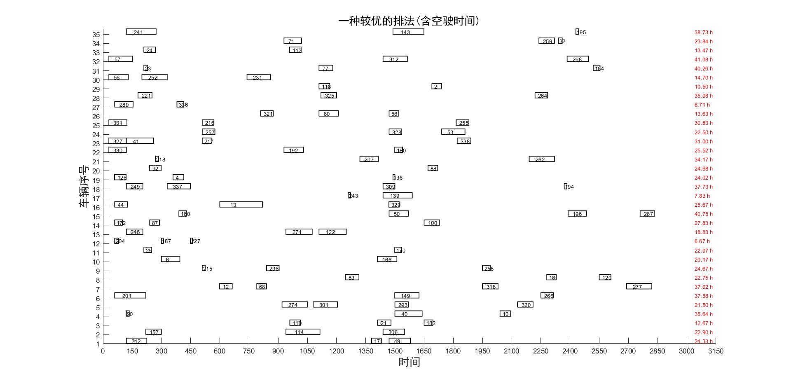

本部分采取启发式算法进行求解探索，以期可以应对大规模问题的求解。最终得到较优解为26094，其中空驶路成为3916，最长行驶时间为41.08小时。在本部分中，主要采取禁忌搜索寻找初始可行解，再利用人工鱼群算法进行进一步的优化。

## 假设描述

该部分的问题假设与上文基本一致。

## 模型建立

这一部分中，对问题进行简化，考虑其目标函数和约束条件如下：

| 符号          | 含义                              |
| ------------- | --------------------------------- |
| $c_n$         | 可用车辆集合                      |
| $t_m$         | 任务集合, m最大取341              |
| $a_{ij}$      | 0-1变量，为1时代表i车执行k号任务  |
| $CAR_i$       | i号车的任务集合                   |
| $d_{k}$       | 完成k号任务的路程长度             |
| $st\_time_k$  | k号任务的开始时间                 |
| $end\_time_k$ | k号任务的结束时间                 |
| $st\_spot_k$  | k号任务的出发地点                 |
| $end\_spot_k$ | k号任务的到达地点                 |
| $empty_{ij}$  | 从i空驶到j的时间，如果不需要则为0 |
| v             | 空驶速度，取1                     |

$$
min\ \ \{\sum^i \sum^j a_{ij}*d_{j}+\sum v*empty\}
$$

其约束条件为

1. 线路不超过四段

   $length(CAR_i) \leq 4, \ i \ \  in \ \ \ c_n$

2. 所有任务都只能且至少覆盖一次

   $(\bigcup CAR_{i})\bigcap T = \emptyset $

3. 每车的任务中，加入空驶后时间不冲突且地点首尾相连、最后一段任务的终点和第一段任务起点相同

   $for\ c \ \ in \ each\  CAR_i$

   ​			$end\_time_c + empty_{ij} <st\_time_{c+1}$

    		   $end\_spot_c = st\_spot_{c+1}$

   $end\_spot_n = st\_spot_1$

## 算法设计

### 编码设计

可以直接用实数编码的方式，即用数字代表车辆序号，比如4号任务数字为20，即20号车执行4号任务。同时为了加快算法的运行速度，引入顺序概念。比如4号任务的数字为20.4555代表20号车以0.4555的顺序执行该任务。

如果有一个原始码[5.432, 5.211, 4.221, 3.265, 3.710 ......]，解码后得到

| 车辆序号 | 执行任务 |      |
| -------- | -------- | ---- |
| 5        | 2-1      |      |
| 4        | 3        |      |
| 3        | 4-5      |      |

判断可行与否可以通过解码后将各车任务依次放入原数据中做对比，判断是否违反约束，在算法中，用w1,w3,w4分别表示违反时间约束，w3表示是否违反段数约束，w4表示是否违反运行时间约束。其中时间约束不仅判断当前是否可运行，同时对加入空驶和任务放入第二天是否可行都进行了判断。而地点衔接约束，可以通过空驶转换为前述三种约束。在判断函数中用w2记录空驶距离。（函数cando.m）

适应度函数则直接按照给解码后方案对应定数据表中的距离加上违反约束带来的惩罚和空驶距离来表示，当方案没有违反约束时，该适应度函数表示的是优化得到的距离。(函数foo.m)

### 初始解构造

初始解可以通过随机数的方式构造，这种方法的优点在于简单快捷，缺点在于会出现过多的不可行解，影响算法的精确度和运行速度；或者采取其他方法构造初始可行解群。这里简单介绍一下初始可行解的构造方法：



可以通过随机打乱1到341作为可行解种子（即每辆车只跑一个任务），然后对该解的每一部分进行随机扰动（由于编码的性质，可以很容易的证明车辆数会少于341，因此只减去一个随机因子便可以得到新解），如果得到的解更优的话，则保存新解。为了加强算法的搜索性能，引入了禁忌表作为辅助搜索策略，即更新解后会更新禁忌表相应的位置，保持该解一段时间。

```c
pop = randperm(341); // 随机打乱1 - 341
best = inf;
for(i =1; i<iter_time; i++ ){
    copy = pop;
    if (tabu(i) < spec){
        pop(i) = pop(i) - pop(i)*rand();
    	if (evaluate(pop) < best)&&(cando(pop)){ 
            best_pop = pop;
			best = evaluate(pop);
            tabu(i) = tl; //更新禁忌表，tl为禁忌步长
		else
            pop = copy;  //如果不符合约束或者没有更优则回退
        }
    }
    //更新禁忌表
    for(j = 1; j<length(tabu); j++){
        if (tabu(j) > 0)
            tabu(j)--；
    }
}
```

### 鱼群算法

鱼群算法是一种现代启发式智能搜索算法，具有现代优化算法的很多特征。通过模拟鱼群的觅食、聚群、追尾行为实现搜索寻优，觅食行为奠定了算法收敛的基础、聚群行为增强了算法收敛稳定性、追尾行为增强了算法收敛的快速性和全局性。同时人工鱼也会随机游动，使得算法可以跳出局部极值的领域。



由于编码的性质，在算法进行之前还需要对得到的初始解群进行转换，确保各初始解中车辆序号相近，以保证后续算子交叉，趋近等行为的效率。(函数encode.m)



#### 参数和人工鱼类的设定

由于人工鱼类比较占用计算资源，因此算法中只设置了10条人工鱼，循环迭代30次进行求解。

人工鱼类有四个参数，即解方案route，按照前文所述编码得到的解，可以采取随机和采用初始解两种方法得到。视野范围visual使得人工鱼可以向附近的最优值靠拢，从而逃离局部极值，视野范围越大越容易发现全局极值并收敛；尝试次数try_num确保人工鱼可以随机游走，增加算法解的多样性；拥挤指数delta用来限制聚集规模，使得较优的地方可以聚集更多的人工鱼。（函数af.m）



#### 人工鱼的四种行为函数的设定

觅食行为是人工鱼的一种基本行为，即在视野范围内，任选一点测试是否可以获得更优值，如果得到了比当前鱼所含解更优的解，则向该方向前进。在本部分中，将该行为简单的用自交叉行为代替，即选定任意位置开始的任意长度个解元素，和任意位置的相同长度个解元素进行交换。判断是否得到更优解。（函数prey.m）

```c
for(i=1;i<af.try_num;i++){
    len = ceil(20*rand());
    pos1 = ceil(321*rand());
    pos2 = ceil(321*rand()); 
	// 即随机生成位置1、2和长度
	temp_af = af;
    temp = af.route(pos1:pos1+len);
    temp_af.route(pos1:pos1+len) = 	af.route(pos2:pos2+len);
    temp_af.route(pos2:pos2+len) = temp;
	if (evaluate(temp_af) < evaluate(af)){
 		af = temp_af;       
    }
}
return af;
```

聚群行为即鱼群自发的向某一点聚集，聚群行为并不需要领头者，而是整体会在个体局部的相互作用下呈现集群现象。在本部分中，认为当前鱼会探索视野范围内的伙伴数目及相对应的中心位置，如果该位置可以获取更优解且尚未饱和（不拥挤)则向该位置移动，同时需要说明的是距离计算采用相似度计算，及两个解之间的不同的元素的个数。（函数swarm.m）

```c
for (i = 1；i<af_total; i++){
    if dstc(af,afs{i}) < af.visual){
        n=n+1;
        temp =  afs{i}.route();
        for (j = 1;j<len_route;j++)
            route_center(j) = route_center(j) + temp(j);  //计算中心位置,求和
    }
}
if (n~=0){
    for (i = 1;i<len_route;i++)
        route_center(i) = round(route_center(i)/n);//计算中心位置,求均值，得到中心位置
}
center = afs{1}.route;
for(i = 2;i<1:af_total;i++){
    afs_route = afs{i}.route;
    out1 = 0;
    out2 = 0;
   // 依次比较每条鱼找到距离接近中心解的鱼
    for (j = 1;j<len_route;j++){
        out1 = out1 + sign(abs(center(j)-route_center(j)));
        out2 = out2 + sign(abs(afs_route(j)-route_center(j)));
    }
    if out2<out1
        center = afs_route;
}

//如果拥挤度可以接受则将该解赋给当前鱼
if (evaluate(center)*n > evaluate(af) *af.delta) && (sum(center)！=sum(af.route))
    af.route = center;

return af
```

追尾行为即人工鱼会向得到较有解的人工鱼行进。和聚群行为实现方法类似，不过从跟踪平均最优值变为了跟踪视野范围内尚未饱和（不拥挤）的最优人工鱼。（函数follow.m）

随机游动比较简单，直接对任意解元素进行随机扰动，判断扰动后结果是否更优。(函数move.m)

## 结果分析

 鱼群算法中，设置人工鱼 10条，视野visual = 100 , 拥挤指数delta = 9, 尝试次数 try_num = 200，迭代次数为30时。

没有加入初始解时，路程为33970，空驶路程11792。

加入初始解后，路程为26094，其中空驶路程为3916。算法迭代图如下



同时尝试使用遗传算法，当种群规模为30，迭代次数为100，变异和交叉概率分别为0.3，0.7时。

没有加入初始解时，路程为44270，空驶路程为22090。

加入初始解后，路程为28270，空驶路程为6273。

| 算法                 | 路程  | 空驶路程 | 违约数 | 运行时间 | 备注             |
| -------------------- | ----- | -------- | ------ | -------- | ---------------- |
| 鱼群算法（无初始解） | 33970 | 11792    | 0      | 173 s    |                  |
| 鱼群算法（有初始解） | 26094 | 3916     | 0      | 76+207 s | 对初始解敏感     |
| 遗传算法（无初始解） | 44270 | 22090    | 0      | 10 s     | 容易得到不可行解 |
| 遗传算法（有初始解） | 28270 | 6093     | 0      | 76+5 s   | 容易早熟         |

最终得到的结果如下图所示：



该算法性能较好，在没有初始可行解时也能很快收敛到一个可行解，在面对大规模问题且求解要求精度不高的情况下，具有良好的适用性。同时由于本次问题讨论中，约束条件和目标较少，存在一定的任务不均衡等情况，可以通过调整目标函数来进行进一步优化$^{[1]}$。